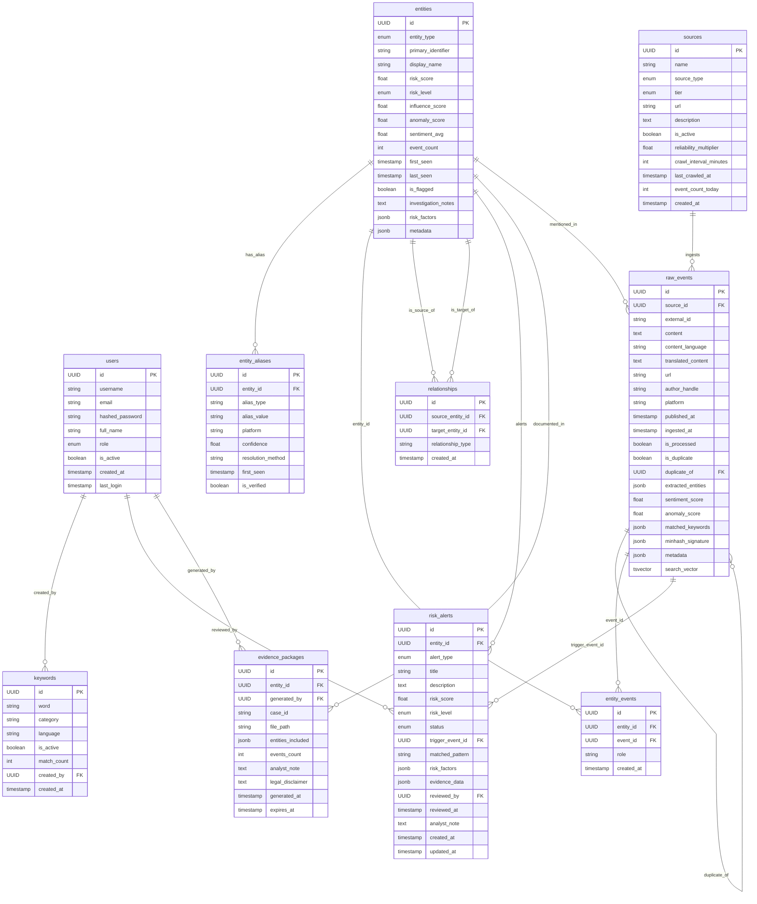

ILA Data Model

This diagram reflects the current SQLAlchemy models in `backend/app/models/__init__.py`.
It is intentionally focused on the tables that power ingestion, enrichment, alerting,
and analyst workflows.

## Notes

- `entity_events` is the join table between `entities` and `raw_events`.
- `risk_alerts` are analyst-facing records generated from the enrichment pipeline.
- `evidence_packages` are generated on demand for a specific entity or case.
- `keywords.created_by` links back to `users`, but it is optional in the current loader flow.
- Some columns such as `search_vector`, `minhash_signature`, and `metadata` are implementation-oriented fields used by search and enrichment code.
